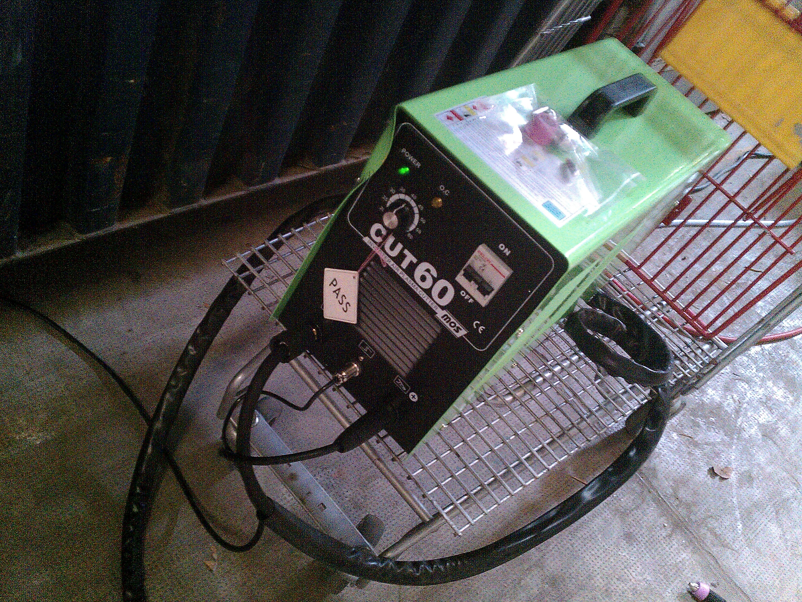
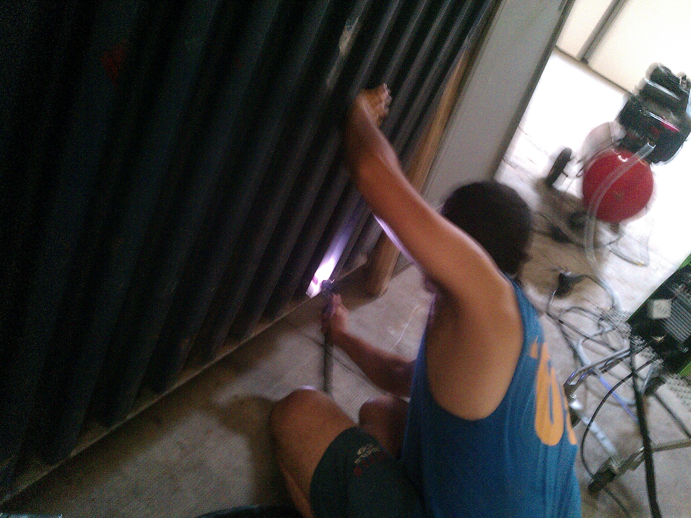
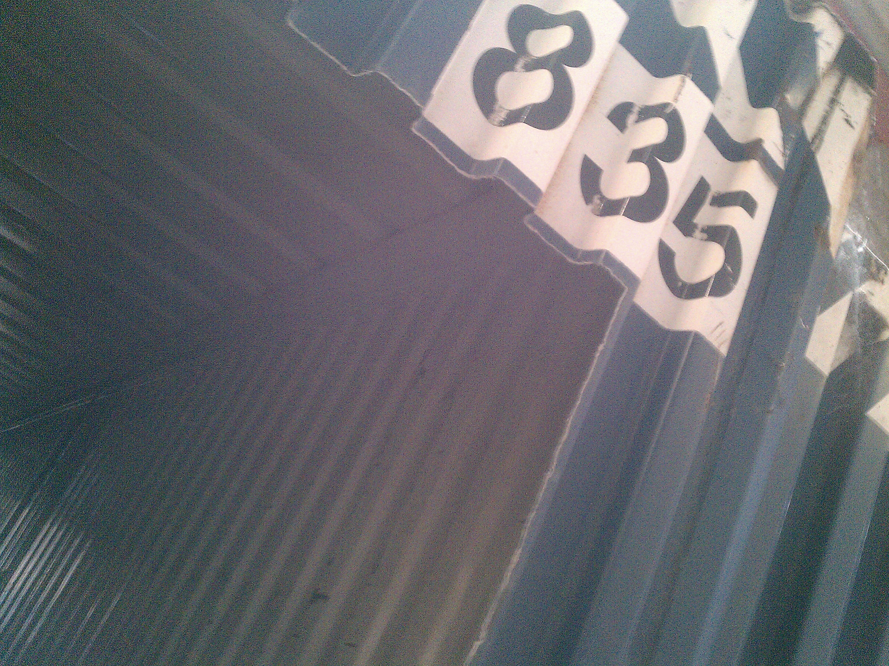
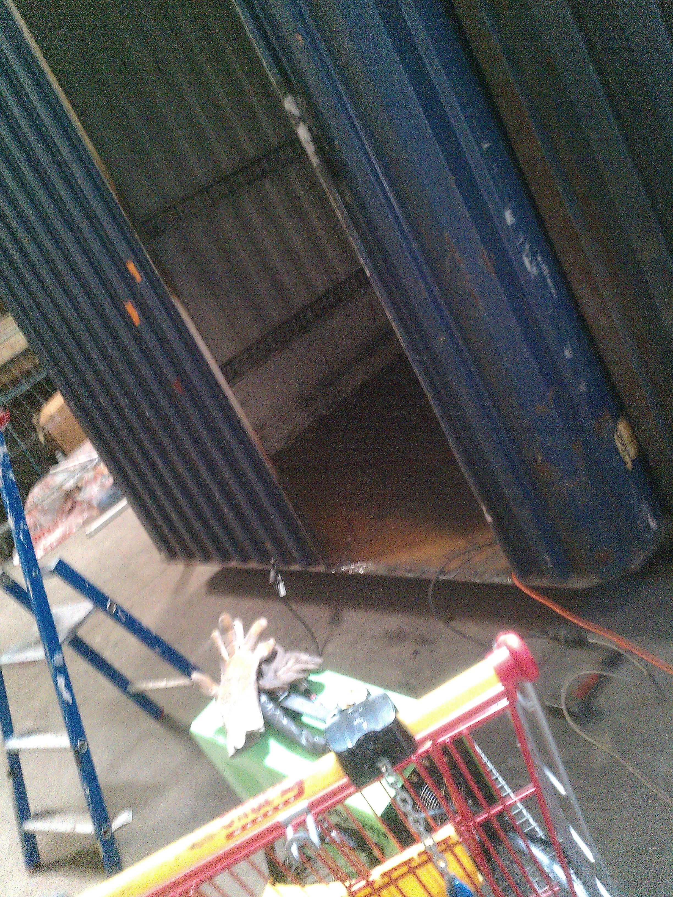

### setup

* decoupeuse plasma 50A 
ici limité a 16/18A car limité par la ligne electrique
* compresseur
* meuleuse 

#jour 1

* nettoyage de la porte de securité
* decoupe encadrement porte
* degaushissage traverse sous container
* ebarbage des restes de coupe

* present : Dr Xano, frtk, metaB

#jour2

| | | |
|-|-|-|
|*Still* | `renders` | **nicely**|
|1 | 2 | 3 |

