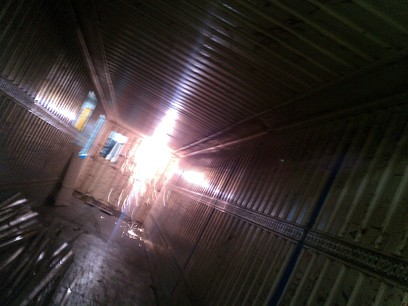
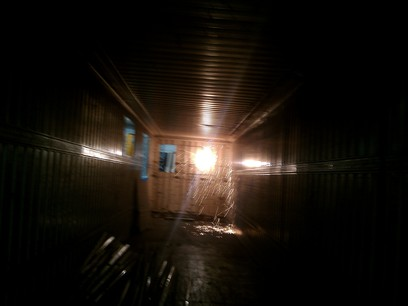

### setup

* decoupeuse plasma 50A 
ici limité a 16/18A car limité par la ligne electrique
* compresseur
* meuleuse 

| galery | du cowboy |
|---|---|
||[alt](./img/resised-IMG_20150716_160553.jpg)

#jour 1

* nettoyage de la porte de securité
* decoupe encadrement porte
* degaushissage traverse sous container
* ebarbage des restes de coupe

* present : Dr Xano, frtk, metaB

| galery | du cowboy |
|---|---|
||[alt](./img/resised-IMG_20150720_115014.jpg)

#jour2

* tracé des decoupes
* découpe de 3 fenetres 

| galery | du cowboy |
|---|---|
||
||
||
||
